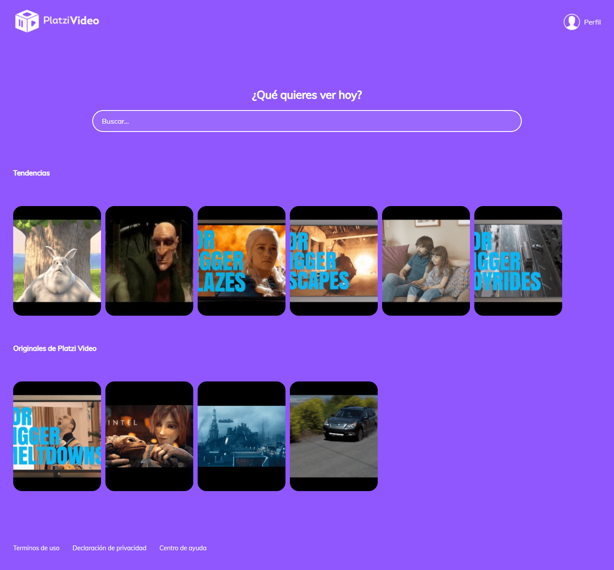

# Platzi Video

Watch videos and add your favorites to your favs list. Built with React and Redux.

## Table of contents 📑

- [Overview](#overview)
  - [The project](#the-project)
  - [Links](#links)
- [My process](#my-process)
  - [Built with](#built-with)
  - [What I learned](#what-i-learned)
  - [Useful resources](#useful-resources)
- [Author](#author)

## Overview 🔎

### The project

Website where you can watch videos and add them to your favorites list. User login and register simulated.

Users are able to:

- View the optimal layout for the site depending on their device's screen size.
- See video description when hover the video card.
- Get their own gravatar on login or register (need a Gravatar account).
- Watch videos in the custom media player.
- Add and remove videos from their favorites list.

### Links

📌 Live Site URL: [here](https://platzi-video-g3rardogo.netlify.app/)

## My process 👨‍💻

### Built with

- Semantic HTML5 markup.
- CSS custom properties.
- Flexbox.
- Mobile-first workflow.
- [React](https://reactjs.org/) - JavaScript library
- [Redux](https://react-redux.js.org/) - JavaScript library.
- [Webpack](https://webpack.js.org/) - Module bundler.
- [ESLint](https://eslint.org/) - JavaScript linter.
- [Gravatar](https://en.gravatar.com/) - Avatar provider.
- [Git](https://git-scm.com/) - Version control system.
- [Netlify](https://www.netlify.com/) - Deploy Project.

### What I learned

With this project I improved my skills with Redux and I understood the Flux architecture. All of this working with ESLint as linter with the Airbnb configuration. Finally, I discovered the Gravatar service and I decided that it will be a good feature on the project.

### Useful resources

- [Understanding Flux Architecture](https://medium.com/swlh/understanding-flux-architecture-9060e5a0399c) - Helpful article to understand the Flux architecture. 🔨

- [React Redux Tutorial for Beginners: The Complete Guide (2020)](https://www.valentinog.com/blog/redux/) - If you are a beginner with React Redux, you must read this guide. 🔮

- [What is a linter?](https://sourcelevel.io/blog/what-is-a-linter-and-why-your-team-should-use-it) - Great article about linters. 🧐

## Author 🐱‍👤

- Website - https://gerardoramirez.netlify.app/
- Twitter - [@g3rardogo](https://twitter.com/g3rardogo)
